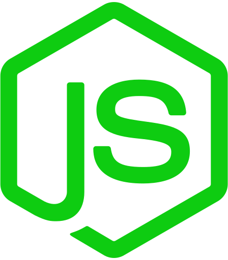
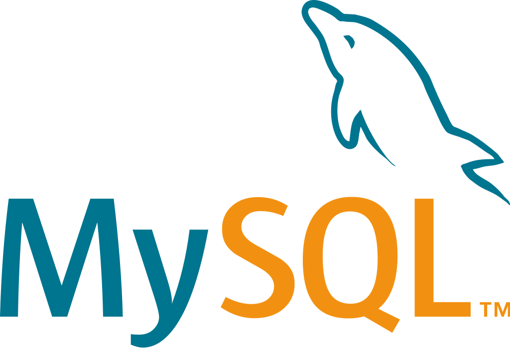
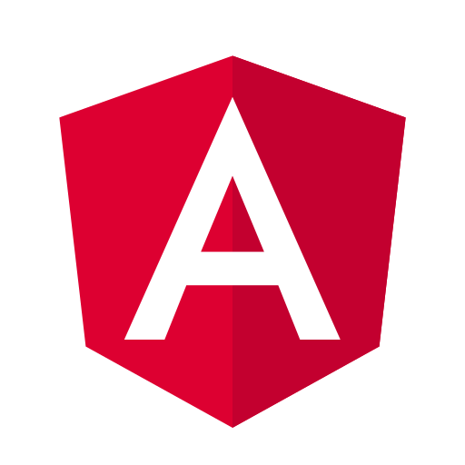

# Joaquín Buendía

## Acerca de Mí

Hola, me llamo Carlo Joaquín Buendía Díaz y me especializo en el desarrollo web frontend.

---

## Proyectos

- [Inventory App](https://github.com/jbuendia1y/inventory-app-monorepo "IN DEVELOPMENT")
- [CheckList App](https://iac-three.vercel.app/ "IN PRODUCTION")
- [Insure Landing Page](https://github.com/jbuendia1y/insure-landing-page-master "IN PRODUCTION")

---

## Tecnologías

---

---
